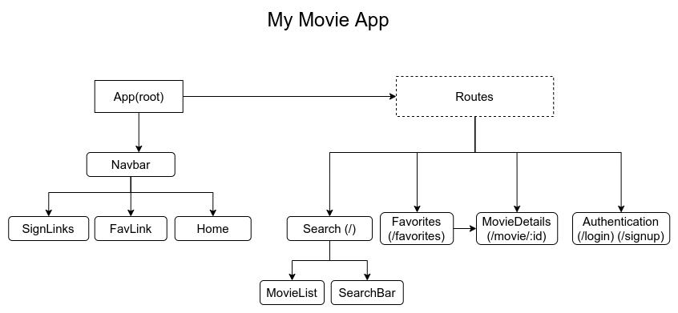

# Movie app

A react app that allows the user to search for movies, see their details and add or remove them to a favourite list. 

## Development Tools

* Javasript
* Sass
* React
* Axios

### `API`

The movie data was retrieved from [OMDb API](/http://www.omdbapi.com/)

## Project Layout
The following flowchart was used in order to structure the project throughout its creation process

## Current Progress
- [x] Create project structure
- [ ] Basic UI prototype
- [ ] Separate into react components
- [ ] Call API to retrieve data
- [ ] Connect API's data to components using hooks
- [ ] Create interactivity

