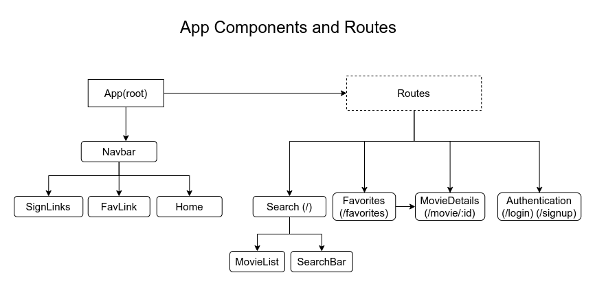

# Fav-Movies app

A react app that allows the user to search for movies, see their details and add or remove them to a favourite list.
The user can create its account, log in and have access to its own favourite list

## Project Layout
The following flowchart was used in order to structure the project throughout its creation process

## Development Tools

* Javasript
* React, react-router
* Tailwind
* Axios

### `API`

The movie data was retrieved from [OMDb API](/http://www.omdbapi.com/)

### `Redux Store`

Redux Toolkit was used to configure and access a global storage

### `Firebase`

The firebase database *Firestore* served as the backend for this project. The user information and their favorite movies get stored here

## Current Progress
- [x] Create project structure
- [x] Separate App workflow into react components
- [x] API data retrieving
- [x] Create Redux store/slice
- [x] Basic UI design using Tailwind
- [x] Create Firebase store and sync with redux
- [x] Authentication dynamic forms
- [x] Create interactivity add/remove to Favourites
- [ ] Responsive design

